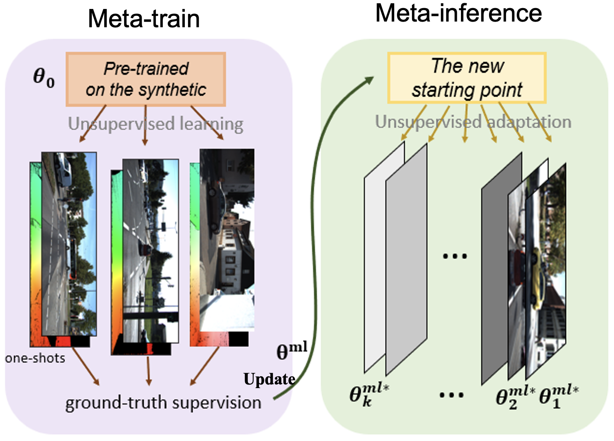
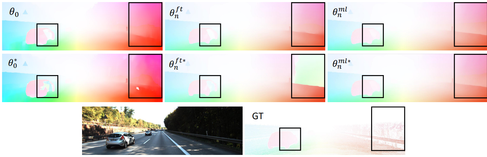

# Meta-Learning for Adaptation of Deep Optical Flow Networks

This is the official implementation of the __MLOF__ _(Meta Learning for Optical Flow)_ framework:

> __Meta-Learning for Adaptation of Deep Optical Flow Networks__  
> [Chaerin Min](https://chaerinmin.github.io/), [Tae Hyun Kim](https://sites.google.com/view/lliger9/team/taehyunkim), [Jongwoo Lim](https://rvlab.snu.ac.kr/people/jwlim)  
> _Proceedings of the IEEE/CVF Winter Conference on Applications of Computer Vision (WACV), 2023._  
> __[Paper](https://openaccess.thecvf.com/content/WACV2023/papers/Min_Meta-Learning_for_Adaptation_of_Deep_Optical_Flow_Networks_WACV_2023_paper.pdf)&nbsp;/ [Video](https://youtu.be/07pSNV6rBj4?si=4f9NJZV--QO9xhQk) / [Poster](assets/readme_poster.pdf)__    

**TL;DR: We present an instance-wise meta-learning algorithm for optical flow domain adaptation**




# News

2023/11/29 - We released the MLOF 1.0.

# Installation

# Dataset 

* [FlyingChairs](https://lmb.informatik.uni-freiburg.de/resources/datasets/FlyingChairs.en.html#flyingchairs)
* [FlyingThings3D](https://lmb.informatik.uni-freiburg.de/resources/datasets/SceneFlowDatasets.en.html)
* [Sintel](http://sintel.is.tue.mpg.de/)
* [KITTI](http://www.cvlibs.net/datasets/kitti/eval_scene_flow.php?benchmark=flow)

```Shell
├── datasets
    ├── Sintel
        ├── training
    ├── KITTI
        ├── training
    ├── FlyingChairs
        ├── data
    ├── FlyingThings
        ├── frames_cleanpass
        ├── frames_finalpass
        ├── optical_flow
```

# Pre-trained model 

Pre-trained checkpoint $\theta _0$ is given in `./checkpoints/gma-thing.pth`

However, if you want to pre-train the optical flow model from scratch, you can do it:

```Shell
sh bash/pretrain.sh
```

# Meta-Train 

```Shell
sh bash/meta_train.sh
```

# Meta-Inference

```Shell
sh bash/meta_inference.sh
```



# Citation

    @inproceedings{min2023meta,
        title={Meta-Learning for Adaptation of Deep Optical Flow Networks},
        author={Min, Chaerin and Kim, Taehyun and Lim, Jongwoo},
        booktitle={Proceedings of the IEEE/CVF Winter Conference on Applications of Computer Vision},
        pages={2145--2154},
        year={2023}
    }

# Related Resources 

The overall code framework is adapted from [GMA: Learning to Estimate Hidden Motions with Global Motion Aggregation](https://github.com/zacjiang/GMA) and [RAFT: Recurrent All Pairs Field Transforms for Optical Flow](https://github.com/princeton-vl/RAFT).